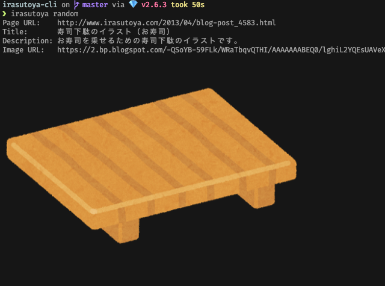

# Irasutoya::Cli

[](https://badge.fury.io/rb/irasutoya-cli)
[](https://codeclimate.com/github/unhappychoice/irasutoya-cli)
[](https://codecov.io/gh/unhappychoice/irasutoya-cli)
[](https://libraries.io/github/unhappychoice/irasutoya-cli)




## Installation

```sh
$ gem install irasutoya-cli
```

## Usage

```sh
$ irasutoya
Commands:
  irasutoya help [COMMAND]  # Describe available commands or one specific command
  irasutoya random          # Gives you random irasutoya image
```

## Contributing

Bug reports and pull requests are welcome on GitHub at https://github.com/unhappychoice/irasutoya-cli. This project is intended to be a safe, welcoming space for collaboration, and contributors are expected to adhere to the [Contributor Covenant](http://contributor-covenant.org) code of conduct.

## License

The gem is available as open source under the terms of the [MIT License](https://opensource.org/licenses/MIT).

## Code of Conduct

Everyone interacting in the Irasutoya::Cli project’s codebases, issue trackers, chat rooms and mailing lists is expected to follow the [code of conduct](https://github.com/unhappychoice/irasutoya-cli/blob/master/CODE_OF_CONDUCT.md).
